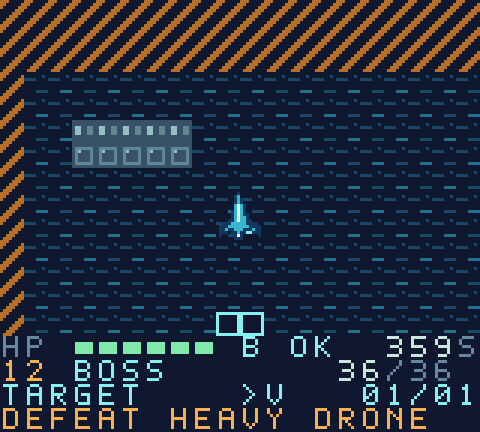

# Rollback

A native Game Boy Color flight-and-combat game for the **ModRetro Chromatic**. Fly, fight, protect your objectives, and restore the timeline when a sortie goes wrong.

**[Download the playable ROM](https://github.com/Zollicoff/Rollback/releases/tag/v0.3.0-world)** · [Mac & cartridge setup](docs/mac-cartridge-setup.md) · [Build plan](docs/build-plan.md)



**Current release: v0.3.0 world prototype.** Explore a 1,600 × 1,440 world—ten times the original width and height—with a camera that follows before you reach any edge. Twelve playable drills exercise the Episode 1 systems, from rescue and sabotage to a three-phase boss. These are temporary scenarios; the authored Episode 1 campaign, dialogue, and story events are still to come. Episodes 2–4 are deferred.

## Play

Download and unzip the [release bundle](https://github.com/Zollicoff/Rollback/releases/tag/v0.3.0-world). Open `rollback-e1-training.gbc` in a Game Boy Color emulator, such as [SameBoy](https://sameboy.github.io/), or follow the [Chromatic cartridge instructions](docs/mac-cartridge-setup.md). The included `.rom` contains identical bytes. The ZIP also includes a quick-start guide, checksums, screenshots, and the verification report.

| Control | Action |
| --- | --- |
| D-pad | Fly and aim in eight directions |
| A | Fire; hold to keep your aim while moving |
| B | Boost; hold beside a sabotage relay to disable it |
| Start | Pause; restart the sortie with Take a Mulligan |
| Select | Toggle sound |

On death, A restores the latest in-game checkpoint; B restarts the sortie. Completed drills unlock the next drill. Record the four-digit resume code to recover progress after switching off. This build does not require cartridge save RAM.

See [Mac setup](docs/mac-cartridge-setup.md) and [release instructions](docs/release-guide.md). The ROM is CGB-only, 64 KiB, MBC5 (`0x19`), with no external RAM. Its compatibility with the physical DevDay cartridge still requires detection and a hardware test.

## Build from source

Python 3.12+ and `make` are needed. The verified development host is Apple Silicon macOS. Toolchain downloads are pinned to GBDK 4.5.0 and checked against official release SHA-256 digests.

```sh
git clone https://github.com/Zollicoff/Rollback.git
cd Rollback
make setup
make
make play
make test
make package
```

Tools live in ignored `.tools/`; generated output lives in ignored `build/` and `dist/`. `GBDK_HOME` and `PYTHON` can be overridden. The SDL emulator uses arrow keys, A=A, S=B, Return=Start, and Backspace=Select.

## What is implemented

- Large worlds (1,600 × 1,440 pixels), terrain streaming in both directions, a camera with horizontal and vertical padding, a fixed bottom HUD, grid coordinates, and direction indicators for distant objectives. Rescue pods, relays, convoy routes, navigation gates, and the boss use world positions.
- Eight-direction flight, aim locking, boost, projectile collisions, cover, enemy drones, hull damage, repair pickups, and synthesized music/SFX.
- Defense, raid, escort, chase, survival, rescue, evade, sabotage, and a three-phase boss.
- Briefing, mission, debrief, replay selection, pause, failure, checkpoint restoration, and a Timeline Damage result.
- Complete checkpoint snapshots of mission state, including enemies, projectiles, objectives, score, timers, and the random generator; retry count remains outside the snapshot.
- Original pixel font, vehicle sprites, terrain, a generic flight-operations portrait, and three training environments based on the supplied Episode 1 setting.
- Editable JSON scenario text compiled to ROM data, deterministic art generation, ROM validation, and automated emulator playthroughs.

## Verification

`make test` boots the actual ROM in PyBoy 2.7.0, uses buttons to interact with it, and observes its LCD, audio, and sprites. It does not modify game RAM or inject mission victories. It checks ROM checksums, audio/mute, movement/fire/pause, invalid and fresh-boot resume codes, checkpoint recovery after death, and completion of all twelve training scenarios. Scrolling checks cover travel to all four world corners and back, both camera axes and reversals, fixed HUD pixels, distant-object clipping, all boundaries, diagonal panning, and restoration of a distant checkpoint. The release includes the result report and screenshots.

Physical cartridge boot, controls, audio, and power-cycle testing are outstanding. Canonical narrative integration, authored Episode 1 layouts, character-specific portraits/barks, and final balancing are also outstanding. Episodes 2–4 are deferred.

## Source layout

- `src/`: runtime, rendering, menus, audio.
- `data/training.json`: temporary scenario definitions and text.
- `tools/assets.py`: original pixel artwork and 2bpp encoding.
- `tools/content.py`: content validation and C generation.
- `tools/verify.py`, `tools/playthrough.py`: cartridge-boundary verification.
- `docs/build-plan.md`: scope, completed work, and remaining work.

Runtime acknowledgments and the GBDK library linking exception are in [THIRD_PARTY_NOTICES.md](THIRD_PARTY_NOTICES.md).

## Feedback and project status

Play reports are welcome in [Issues](https://github.com/Zollicoff/Rollback/issues). Include the release version, emulator or hardware, drill number, and what happened. For checkpoints or resume codes, describe the steps leading to the problem.

The project has not yet selected a general source or asset license. The third-party notices apply to their named components.
