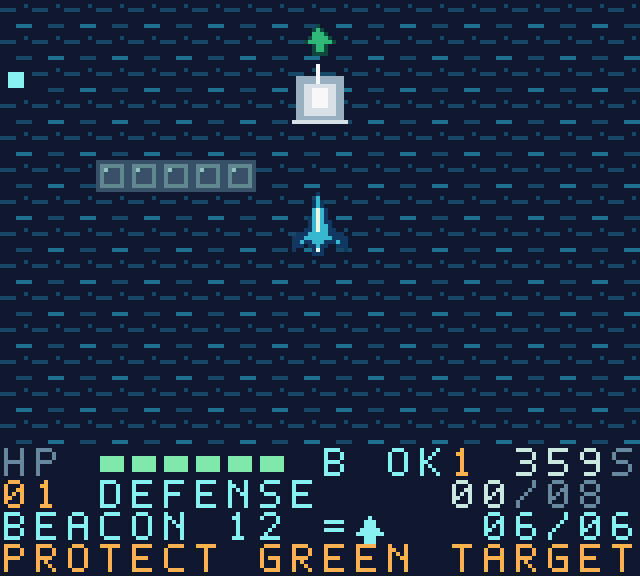
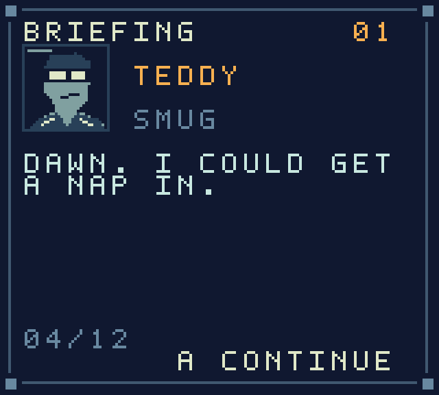

# Rollback

**Five misfits. One stolen time machine. Zero successful fixes.**

A native Game Boy Color flight-and-combat game for **ModRetro Chromatic**. The campaign follows Teddy, Mae, Felix, Dotty, and Gus through all four episodes of the supplied story.

**[Download the ROM](https://github.com/Zollicoff/Rollback/releases/tag/v0.4.0-campaign)** · [Mac & cartridge setup](docs/mac-cartridge-setup.md) · [Campaign adaptation](docs/campaign-adaptation.md)



## Campaign

- **54 missions across four episodes**, with the complete authored briefings, radio exchanges, debriefs, and main ending.
- An unlocked **Loop 2**, an alternate Mission 53, and the noncombat “Morning After” ending.
- Large **1,600 × 1,440** worlds, scrolling on both axes before the ship reaches an edge, with a fixed HUD and colored objective arrows.
- Ten terrain themes: flooded Kestrel, the Channel, night river, air base, server farm, and the changed worlds leading to Day Zero.
- Defense, raids, escorts, pursuit, survival, rescue, evasion, sabotage, and bosses. Special missions include radar sweeps, duplicate ships, multiple chase targets, peaceful machines, an upload defense, and scripted setbacks that advance the story.
- Character portraits and moods, story-aware combat barks, eight pickups, four difficulty settings, an archive, and session achievements.



This is the first complete native campaign build. It uses text dialogue and synthesized music/SFX. Physical Chromatic testing and further human balance/polish feedback are still needed. The [adaptation notes](docs/campaign-adaptation.md) explain how the screenplay maps to the handheld, including compressed narrative waits and progress limitations.

## Play

Unzip the [release bundle](https://github.com/Zollicoff/Rollback/releases/tag/v0.4.0-campaign) on your MacBook Pro and open `rollback.gbc` in a Game Boy Color emulator. `rollback.rom` contains identical bytes. To use the rewritable cartridge, follow the [Mac setup guide](docs/mac-cartridge-setup.md).

| Control | Action |
| --- | --- |
| D-pad | Fly and aim in eight directions |
| A | Fire; hold to keep aim while moving; advance briefings/radio |
| B | Boost; hold beside a sabotage site; talk during the unlocked final encounter |
| Start | Pause; intentionally advance results/debriefs; rewind after defeat |
| Select | Toggle sound; return to mission selection from defeat |

Radio pauses combat while you read; release A, then press it to advance. On defeat, release the controls briefly; Start restores the checkpoint, B restarts the mission, and Select returns to mission selection. Firing cannot dismiss the results or debrief. Checkpoints include the world, camera, enemies, objectives, timer, power-ups, RNG, and story events.

Record the **six-digit resume code**. It restores mission access, difficulty, completion, and loop after power-off without relying on cartridge save RAM. Skill achievements and session statistics are not stored in the code. Earlier four-digit training codes belong to the older prototype.

The cartridge declares **CGB-only, MBC5 (`0x19`), 256 KiB ROM, no external RAM**. Confirm these against the detected cart before writing. See the [release guide](docs/release-guide.md).

## Build

Python 3.12+ and `make` are required. Development and verification run on Apple Silicon macOS. The local toolchain pins GBDK 4.5.0 and PyBoy 2.7.0.

```sh
git clone https://github.com/Zollicoff/Rollback.git
cd Rollback
make setup
make
make play
make test
make package
```

Generated output goes to ignored `build/` and `dist/`; tools live in ignored `.tools/`. Override `GBDK_HOME` or `PYTHON` if needed. The SDL player maps arrow keys to the D-pad, A to A, S to B, Return to Start, and Backspace to Select.

## Verification and source

`make test` runs the actual cartridge using controller input and observes LCD output, OAM, and audio. It checks ROM integrity, sound, passwords, checkpoints, camera movement and boundaries, objective arrows, all 54 missions, and the alternate ending. Displayed briefings and debriefs are compared with the supplied Markdown independently of the content compiler. Tests do not modify game RAM or inject victories. The release includes the exact ROM hash and results in `verification.json`.

- `story/source/`: all nine supplied documents, unchanged, with an import hash manifest.
- `data/campaign.json`: mission layouts, routes, rules, and balance parameters.
- `src/`: native runtime, story progression, barks, bank readers, rendering, menus, and audio.
- `tools/campaign.py`: validated screenplay-to-ROM compilation.
- `tools/assets.py`, `tools/portraits.py`: native pixel art and tile generation.
- `tools/verify_campaign.py`: cartridge verification and mission playthroughs.

Earlier training releases remain available in [Releases](https://github.com/Zollicoff/Rollback/releases). [Build history](docs/build-plan.md) records the platform and scope changes. Report play issues with the mission number, difficulty, release version, and emulator or hardware.

The project has not selected a general source or asset license. Runtime acknowledgments and the GBDK library linking exception are in [THIRD_PARTY_NOTICES.md](THIRD_PARTY_NOTICES.md).
